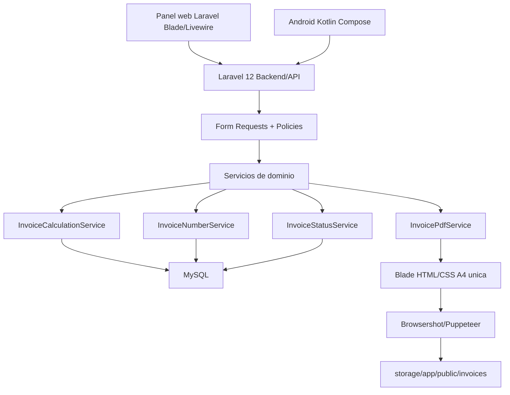

# FASE 0 - Analisis de plantilla y arquitectura

## Objetivo

Documentar la plantilla oficial, pantallas de referencia, campos, calculos y decisiones base antes de crear codigo productivo.

## Fuentes revisadas

- `Factura P L - Oficial.xlsx`
- `factura.png`
- `Principales pantallas/vista_previa_pdf_r_plica_oficial/screen.png`
- `Principales pantallas/saas_billing_invoicing_design_system/DESIGN.md`
- `Principales pantallas/nueva_factura_orden_optimizado_facturapro/code.html`
- `Principales pantallas/login_facturapro/code.html`
- `Promt Master.txt`
- `Guia de desarrollo.txt`

## Estructura del Excel

El libro contiene dos hojas:

- `FACTURA `: plantilla visual de factura.
- `FUNCIONES`: catalogos base usados por la plantilla.

La hoja `FACTURA ` usa un layout de 31 filas por 15 columnas, con muchas celdas combinadas para replicar un formato impreso. La factura visual real se concentra aproximadamente entre columnas B-K y filas 2-31.

La hoja `FUNCIONES` contiene catalogos iniciales:

- Terminos de pago: `AL CONTADO`, `CREDITO`.
- IVA: `21%`.
- Cuentas bancarias: una cuenta oficial y una cuenta etiquetada como `PIRATA`.
- Garantias: 1 ano, 6 meses y 3 anos.
- Datos de venta/emisor: nombres, CIF y direccion.

## Mapa visual de la factura

- Encabezado izquierdo: logo y marca `TU TECNICO AUTORIZADO / SERVICIOS TECNICOS`.
- Encabezado derecho: titulo `FACTURA`, numero de factura, fecha de cotizacion/factura, vencimiento y termino de pago.
- Datos cliente: `FACTURAR A` y `DIRECCION`.
- Tabla de lineas: descripcion, cantidad, costo unitario, IVA, precio unitario e importe.
- Totales: importe recibido, subtotal, IVA y total a pagar.
- Bloque garantia: texto de garantia seleccionado.
- Bloque observaciones.
- Cuentas bancarias.
- Indicador `ORIGINAL: CLIENTE / COPIA: VENDEDOR`.
- Firmas: recibido por y preparado por.
- Conformidad del cliente.
- Texto legal inferior.

## Campos visibles

### Factura

- Numero de factura.
- Fecha de factura o cotizacion.
- Cliente.
- Direccion del cliente.
- Vencimiento.
- Termino de pago.
- Descripcion de cada linea.
- Cantidad.
- Costo unitario.
- IVA/impuesto.
- Precio unitario.
- Importe.
- Importe recibido.
- Subtotal.
- IVA total.
- Total a pagar.
- Garantia.
- Observaciones.
- Cuenta bancaria.
- Recibido por.
- Preparado por.
- Conformidad del cliente.
- Texto legal inferior.

### Emisor

El Excel contiene datos de emisor en `FUNCIONES`, pero no estan normalizados para sistema multi-configurable. En la aplicacion deben migrarse a `fiscal_profiles`:

- Nombre fiscal.
- CIF/RNC/NIF/Tax ID.
- Direccion.
- Ciudad.
- Telefono.
- Email.
- Logo.
- Estado activo/default.

## Formulas detectadas

En `FACTURA `:

- `H11:H16 = G fila * $B$17`: calcula impuesto por linea usando IVA global.
- `I11:I16 = SUM(G fila:H fila)`: calcula precio unitario con impuesto.
- `J11:J16 = I fila`: copia importe visual.
- `J18 = SUM(G11:G16)`: subtotal.
- `J19 = SUM(H11:H16)`: IVA total.
- `J20 = SUM(J11:K16)`: total visual.

Problema tecnico: la formula actual no multiplica por cantidad al calcular importe final. La cantidad aparece en columna F, pero no participa en `J11:J16`. Para produccion esto no sirve como regla de negocio. La plantilla se usara como referencia visual, no como fuente de calculo.

## Reglas de calculo correctas

### Precios sin impuesto incluido

```text
line_subtotal = quantity * unit_cost
tax_amount = line_subtotal * tax_rate
unit_price = unit_cost + (unit_cost * tax_rate)
line_total = line_subtotal + tax_amount
```

### Precios con impuesto incluido

```text
line_total = quantity * unit_price
line_subtotal = line_total / (1 + tax_rate)
tax_amount = line_total - line_subtotal
unit_cost = line_subtotal / quantity
```

### Totales

```text
subtotal = sum(line_subtotal)
tax_total = sum(tax_amount)
total = subtotal + tax_total
balance_due = total - amount_received
```

El backend debe recalcular siempre estos valores. Los totales enviados por web o Android son informativos y no confiables.

## Campos editables

- Cliente seleccionado o datos snapshot si procede.
- Fecha de factura.
- Termino de pago.
- Vencimiento, con autocalculo y posible ajuste autorizado.
- Moneda.
- Perfil fiscal.
- Cuenta bancaria.
- Garantia seleccionada.
- Texto de garantia editable antes de emitir.
- Observaciones.
- Lineas de factura: descripcion, cantidad, costo/precio, impuesto.
- Importe recibido.
- Recibido por.
- Preparado por.
- Firma digital opcional.

## Campos configurables

- Monedas.
- Impuestos.
- Terminos de pago.
- Garantias.
- Cuentas bancarias.
- Perfiles fiscales/emisores.
- Textos legales.
- Numeracion de facturas.
- Roles y permisos.
- Parametros globales de impuesto: mostrar/ocultar, exenta, precios con o sin impuestos incluidos.

## Campos calculados por backend

- Numero de factura cuando no sea manual autorizado.
- Fecha de vencimiento por termino de pago.
- Subtotal por linea.
- Impuesto por linea.
- Precio unitario derivado.
- Importe por linea.
- Subtotal general.
- Impuesto total.
- Total.
- Balance pendiente.
- Estado.
- Ruta final del PDF.

## Estados de factura

- `BORRADOR`: editable completo.
- `EMITIDA`: edicion restringida.
- `PARCIALMENTE_PAGADA`: pago parcial, montos restringidos.
- `PAGADA`: no modificar montos.
- `VENCIDA`: balance pendiente y vencimiento pasado.
- `ANULADA`: no modificar.

## Riesgos y correcciones necesarias

- La plantilla Excel no calcula importes con cantidad. Corregir en servicio de backend, no en la plantilla.
- La hoja `FUNCIONES` contiene una cuenta con nombre informal `PIRATA`. No debe migrarse como semilla ni aparecer en produccion.
- El Excel usa IVA global, pero el sistema requiere impuesto por linea. La base de datos y servicios deben soportar impuestos diferentes por item.
- La factura actual tiene pocas filas visibles. El HTML/PDF debe soportar filas variables sin romper A4.
- Los nombres, CIF y cuentas del Excel parecen datos personales/reales. Deben tratarse como referencia local y no como datos semilla definitivos sin confirmacion.
- Browsershot/Puppeteer en Windows/XAMPP requiere validar instalacion de Node y permisos de ejecucion en servidor.
- El diseno de pantallas de referencia usa CDN y assets externos. En Laravel productivo deben compilarse assets locales y evitar dependencias externas innecesarias.

## Arquitectura propuesta



## Decision para PDF

Se usara una plantilla Blade unica:

```text
resources/views/pdf/invoice.blade.php
```

Esa plantilla servira para:

- Vista previa web.
- Generacion PDF final.

La generacion PDF debe ocurrir exclusivamente en Laravel mediante `InvoicePdfService`. Android solo solicitara generacion, descarga o compartir usando el PDF generado por backend.

## Decision frontend web

Blade + Livewire es la opcion inicial mas robusta para este proyecto:

- Formularios administrativos densos.
- Menor complejidad de build que una SPA completa.
- Integracion directa con validaciones Laravel.
- Suficiente para dashboard, configuracion, clientes y facturas.

Vue solo se justificaria si el editor de facturas exige interaccion compleja que Livewire no pueda mantener con buen rendimiento.

## Contratos iniciales de datos

### Invoice item

- `description`: requerido.
- `quantity`: decimal mayor que 0.
- `unit_cost`: decimal mayor o igual que 0.
- `tax_id`: requerido si se muestran impuestos.
- `tax_rate`: snapshot.
- `tax_amount`: calculado.
- `unit_price`: calculado.
- `line_subtotal`: calculado.
- `line_total`: calculado.

### Invoice

- Cliente requerido.
- Moneda requerida.
- Fecha requerida.
- Termino de pago requerido.
- Al menos una linea.
- Numero unico.
- Snapshot de cliente, moneda, emisor, garantia y texto legal.
- Totales calculados por backend.

## Validacion de FASE 0

- Se reviso la estructura del Excel con extraccion programatica.
- Se verifico visualmente `factura.png`.
- Se reviso la pantalla de preview PDF de referencia.
- Se reviso el sistema de diseno.
- Se detectaron inconsistencias de formulas y datos no aptos para produccion.

## Resultado

FASE 0 queda completada para iniciar FASE 1. La siguiente accion tecnica debe ser validar PHP/Composer y crear la base Laravel 12.
